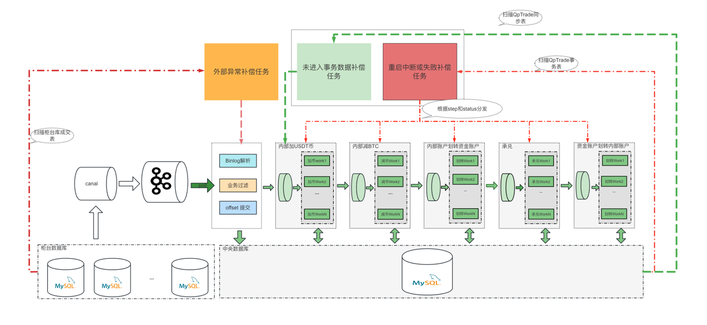

# 承兑服务设计方案

## 难点

1. 夸系统低延迟交易订单同步及状态同步
2. 高并发下的基于三个换币基础核心功能完成
3. 服务部署或者容器化部署换币补偿动作丢失状态

## 要点

1. Canal 同步订单表 + 基于订单id+status扫描同步+幂等入库
2. Disruptor 多线程并发完成三步换币接口调用
3. 三个补偿任务解决 同步异常丢失+ 重启订单状态异常
4. 

## 核心逻辑

